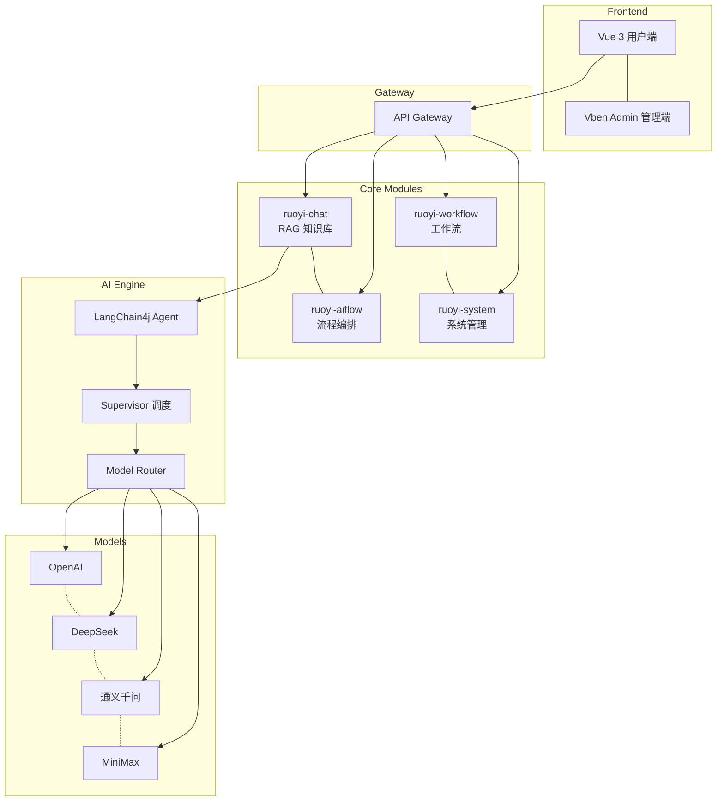
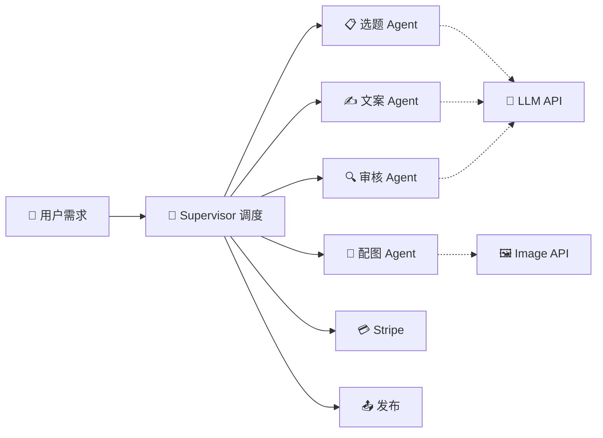
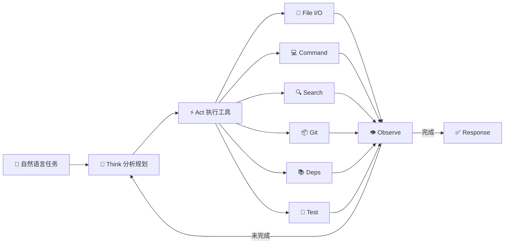

 

### Hi there 👋 I'm 1byteone

> Building intelligent systems, one line of Java at a time.

---

### 👨‍💻 About Me

从 Java 企业后端开发起步，深耕 Spring Boot 微服务架构多年。随着大模型时代的到来，将技术重心逐步转向 AI 应用与 Agent 开发，致力于将 LLM 能力落地到真实业务场景。

目前专注于企业级 AI Agent 框架搭建、多智能体协同调度以及 RAG 知识库应用。相信 AI Agent 将重塑企业软件的交互范式——从"点击操作"到"自然对话"，从"固定流程"到"自主决策"。

- 🏗️ 构建了 **ruoyi-ai** — 一站式企业 AI 应用开发框架
- 🤖 开发了 **mewpaw-code** — Java 21 CLI Coding Agent
- ✍️ 实践了 **ai-passage-creator-demo** — 多 Agent 协作内容生成系统

---

### 🛠️ Tech Stack

#### Backend

#### AI & Agent

#### Tools

---

### 📊 GitHub Stats

 

---

### 🚀 Featured Projects

#### 🏗️ ruoyi-ai — 企业级 AI 应用开发框架

> 一站式 AI 应用开发平台，支持多厂商大模型统一接入、企业知识库 RAG、可视化流程编排与多智能体协同调度。

`Java` `Spring Boot 3.5` `LangChain4j` `Python` `MySQL` `Redis` `Docker`

- 🔗 **多模型统一接入** — 兼容 OpenAI / DeepSeek / 通义千问 / MiniMax，一行配置切换
- 🧠 **企业知识库 RAG** — 本地 RAG + 向量库（Milvus/Weaviate），高精度检索增强
- 🔄 **可视化流程编排** — 拖拽式 AI 工作流设计，Supervisor 多智能体协同
- 🛡️ **企业级安全** — Sa-Token + JWT 双认证，数据脱敏，全链路审计

📐 架构图

---

#### ✍️ ai-passage-creator-demo — AI 爆款文章生成器

> 基于多 Agent 协作的智能内容创作系统，覆盖选题分析、文案生成、智能配图到在线支付的完整链路。

`Java` `Spring Boot 3.5` `Spring AI` `Go` `Python` `Vue 3` `Stripe`

- 🤝 **多 Agent 编排** — 选题 Agent + 文案 Agent + 配图 Agent 协同创作，流水线式内容生产
- 🎨 **智能配图选择** — 多种配图方式（AI 生图 / 素材库 / 混搭），自动匹配最佳方案
- 💳 **Stripe 在线支付** — 完整商业化闭环，支持付费内容生成
- 🧩 **三语言后端** — 同时提供 Java / Go / Python 三种版本，技术选型灵活

📐 多 Agent 协作流程

---

#### 🤖 mewpaw-code — Java 21 CLI Coding Agent

> 纯 Java 实现的命令行编码智能体，ReAct Agent Loop + 5 层安全沙箱 + 6 个内置工具，TUI/REPL 交互体验。

`Java 21` `ReAct Agent` `CLI/TUI` `Docker` `Python`

- 🌀 **ReAct Agent Loop** — Think → Act → Observe 循环，自主规划和执行编码任务
- 🔒 **5 层安全沙箱** — 命令白名单 + 文件隔离 + 网络限制 + 资源配额 + 审计日志
- 🛠️ **6 个内置工具** — 文件读写、命令执行、代码搜索、Git 操作、依赖管理、测试运行
- 🖥️ **TUI/REPL 交互** — 终端原生体验，支持对话式编程和实时反馈

📐 ReAct Agent Loop

---

### 🎯 Currently Focus

- 🔭 I'm currently working on **Java + AI Agent application development**
- 🌱 I'm currently learning **AI Agent frameworks, LLM application architecture**
- 👯 I'm looking to collaborate on **AI open-source projects**

---

### 📬 Get in Touch

 

*"Building intelligent systems, one line of Java at a time."*

