

 

### Hi there 👋 I'm 1byteone

> Building intelligent systems, one line of Java at a time.

---

### 👨‍💻 About Me

从 Java 企业后端开发起步，深耕 Spring Boot 微服务架构多年。随着大模型时代的到来，将技术重心逐步转向 AI 应用与 Agent 开发，致力于将 LLM 能力落地到真实业务场景。

目前专注于企业级 AI Agent 框架搭建、多智能体协同调度以及 RAG 知识库应用。相信 AI Agent 将重塑企业软件的交互范式——从"点击操作"到"自然对话"，从"固定流程"到"自主决策"。

- 🏗️ 构建了 **ruoyi-ai** — 一站式企业 AI 应用开发框架
- 🤖 开发了 **mewpaw-code** — Java 21 CLI Coding Agent
- ✍️ 实践了 **ai-passage-creator-demo** — 多 Agent 协作内容生成系统

---

### 🛠️ Tech Stack

#### Backend

#### AI & Agent

#### Tools

---

### 📊 GitHub Stats

 

---

### 📈 Contribution Graph

 

 

---

### 🚀 Featured Projects

#### 🏗️ ruoyi-ai — 企业级 AI 应用开发框架

> 一站式 AI 应用开发平台，支持多厂商大模型统一接入、企业知识库 RAG、可视化流程编排与多智能体协同调度。

`Java 17` `Spring Boot 3.5` `LangChain4j` `langgraph4j` `Sa-Token` `MySQL` `Redis` `Milvus` `Neo4j` `Docker`

- 🔗 **多模型统一接入** — OpenAI / DeepSeek / 通义千问 / 智谱 / MiniMax / Ollama，工厂模式一键切换
- 🧠 **企业知识库 RAG** — 文档加载 → 切分 → 向量化 → 检索 → 重排全链路，支持 Milvus/Weaviate/Qdrant + Neo4j GraphRAG
- 🤖 **Supervisor 多智能体** — 基于 LangChain4j Agentic API，SupervisorAgent 调度 Skills/WebSearch/SQL/Chart 子智能体
- 🔄 **可视化流程编排** — 基于 langgraph4j 的节点图引擎，支持人机协作与 SSE 流式响应
- 🛡️ **企业级安全** — Sa-Token 认证 + MCP 工具协议 + 全链路可观测

<a href="https://github.com/1byteone/ruoyi-ai">
  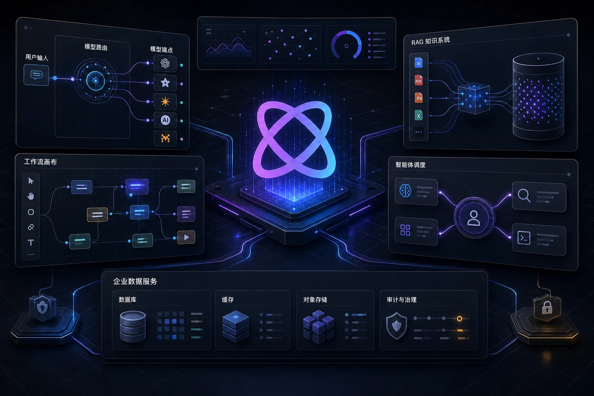
</a>

<strong>中文 Hero 与项目机制图</strong>

 

<a href="https://github.com/1byteone/ruoyi-ai">
  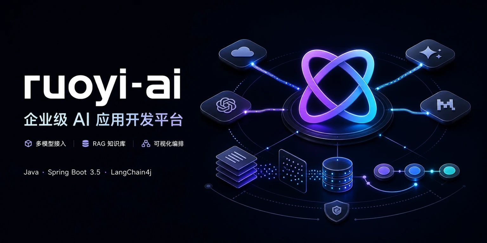
</a>

  

<a href="https://github.com/1byteone/ruoyi-ai">
  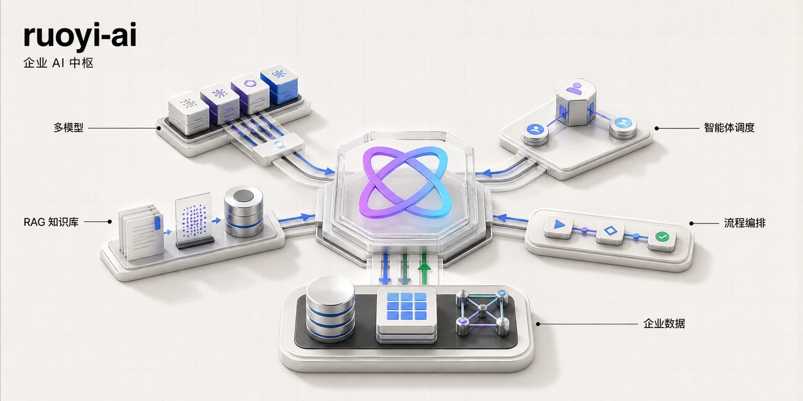
</a>

📐 架构图

 

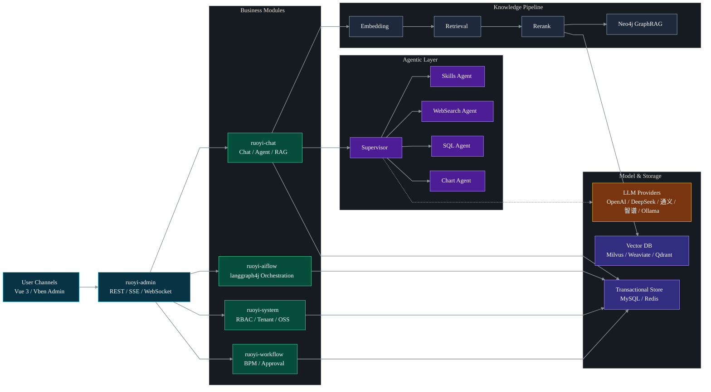
```mermaid
%%{init: {"theme":"base","flowchart":{"curve":"linear","nodeSpacing":38,"rankSpacing":50},"themeVariables":{"background":"#0d1117","primaryTextColor":"#e6edf3","lineColor":"#8b949e","tertiaryColor":"#161b22","clusterBkg":"#161b22","clusterBorder":"#30363d","edgeLabelBackground":"#0d1117","fontFamily":"ui-monospace, SFMono-Regular, Menlo, Monaco, Consolas, monospace"}}}%%
flowchart LR
    UI["User Channels<br/>Vue 3 / Vben Admin"]
    API["ruoyi-admin<br/>REST / SSE / WebSocket"]

    subgraph MOD["Business Modules"]
        direction TB
        CHAT["ruoyi-chat<br/>Chat / Agent / RAG"]
        FLOW["ruoyi-aiflow<br/>langgraph4j Orchestration"]
        WF["ruoyi-workflow<br/>BPM / Approval"]
        SYS["ruoyi-system<br/>RBAC / Tenant / OSS"]
    end

    subgraph AGENT["Agentic Layer"]
        direction TB
        SUP["Supervisor"]
        SKILL["Skills Agent"]
        WEB["WebSearch Agent"]
        SQL["SQL Agent"]
        CHART["Chart Agent"]
    end

    subgraph PIPE["Knowledge Pipeline"]
        direction TB
        EMBED["Embedding"]
        RETR["Retrieval"]
        RERANK["Rerank"]
        GRAPH["Neo4j GraphRAG"]
    end

    subgraph DATA["Model & Storage"]
        direction TB
        MODELS["LLM Providers<br/>OpenAI / DeepSeek / 通义 / 智谱 / Ollama"]
        VECTOR["Vector DB<br/>Milvus / Weaviate / Qdrant"]
        STORE["Transactional Store<br/>MySQL / Redis"]
    end

    UI --> API
    API --> CHAT
    API --> FLOW
    API --> WF
    API --> SYS
    CHAT --> SUP
    SUP --> SKILL
    SUP --> WEB
    SUP --> SQL
    SUP --> CHART
    CHAT --> EMBED --> RETR --> RERANK
    RERANK --> VECTOR
    RERANK --> GRAPH
    SUP -.-> MODELS
    CHAT --> STORE
    FLOW --> STORE
    SYS --> STORE
    WF --> STORE

    classDef entry fill:#083344,stroke:#22d3ee,color:#ffffff
    classDef module fill:#064e3b,stroke:#34d399,color:#ffffff
    classDef agent fill:#4c1d95,stroke:#a78bfa,color:#ffffff
    classDef pipe fill:#1e293b,stroke:#94a3b8,color:#ffffff
    classDef data fill:#312e81,stroke:#a78bfa,color:#ffffff
    classDef ext fill:#78350f,stroke:#fbbf24,color:#ffffff
    class UI,API entry
    class CHAT,FLOW,WF,SYS module
    class SUP,SKILL,WEB,SQL,CHART agent
    class EMBED,RETR,RERANK,GRAPH pipe
    class VECTOR,STORE data
    class MODELS ext
    linkStyle default stroke:#8b949e,stroke-width:1.5px
```

_补充：专业版架构图，可点击查看 HTML 导出版。_

<a href="./diagrams/ruoyi-ai-architecture.html">
  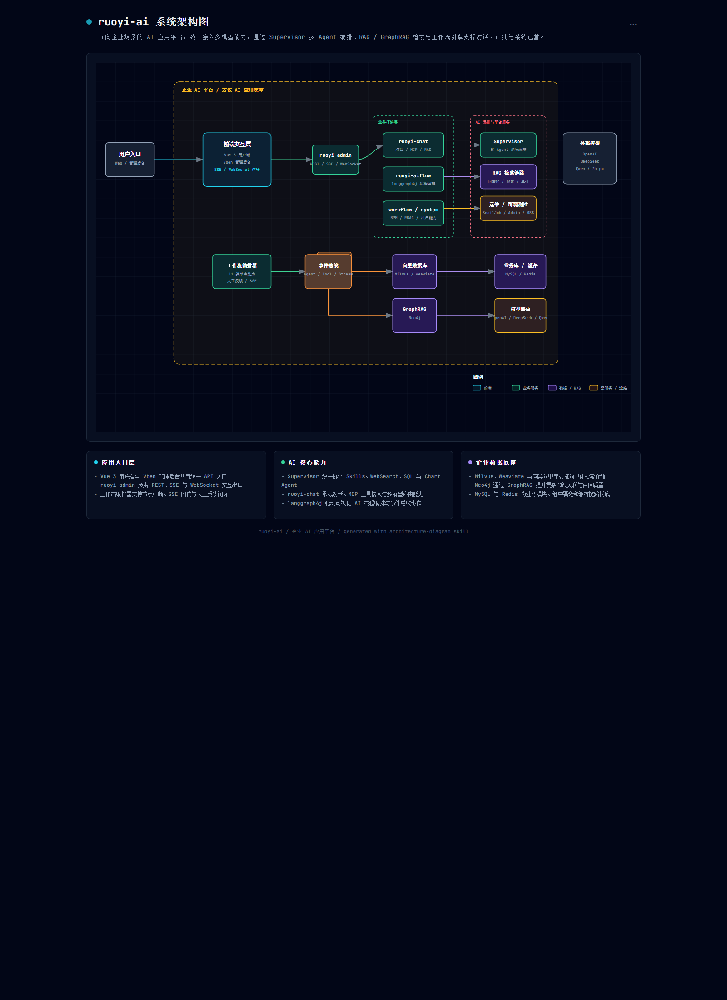
</a>

---

#### ✍️ ai-passage-creator — AI 驱动的内容创作平台（灵犀写作）

> 基于 Spring AI Alibaba StateGraph 的多智能体内容创作平台，5 大专业 Agent 流水线编排，6 种配图策略并行执行，Stripe 商业闭环。

`Java 21` `Spring Boot 3.5` `Spring AI Alibaba` `StateGraph` `MyBatis-Flex` `Vue 3` `DashScope` `Gemini` `Stripe`

- 🤖 **StateGraph 多智能体编排** — Title → Outline → Content → ImageAnalyzer → ParallelImage → Merger，6 节点状态图
- 🎨 **6 策略并行配图** — Pexels / Nano Banana(Gemini) / Mermaid CLI / Iconify / Bing 表情包 / AI SVG，CompletableFuture 并行 + 自动降级
- 💳 **Stripe VIP 商业闭环** — Checkout Sessions + Webhook 签名校验，终身 VIP 解锁无限额度与高级配图
- ⚡ **SSE 实时流式** — DashScope 流式 LLM 输出实时推送前端，心跳保活 + 按 taskId 精准路由
- 📊 **AOP 可观测性** — @AgentExecution 注解自动采集 Agent 执行日志，AgentLog 表全链路追踪

<a href="https://github.com/1byteone/ai-passage-creator">
  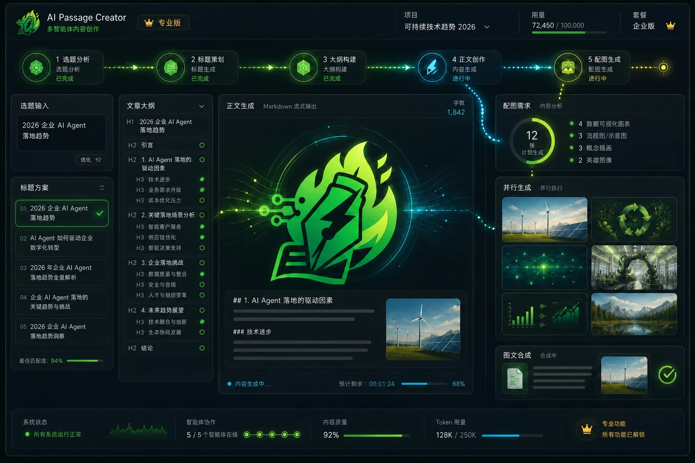
</a>

<strong>中文 Hero 与项目机制图</strong>

 

<a href="https://github.com/1byteone/ai-passage-creator">
  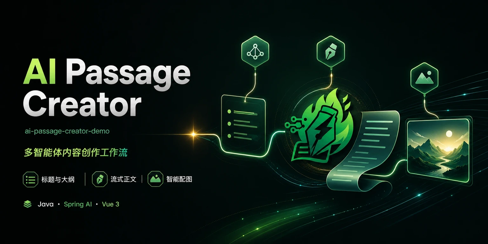
</a>

  

<a href="https://github.com/1byteone/ai-passage-creator">
  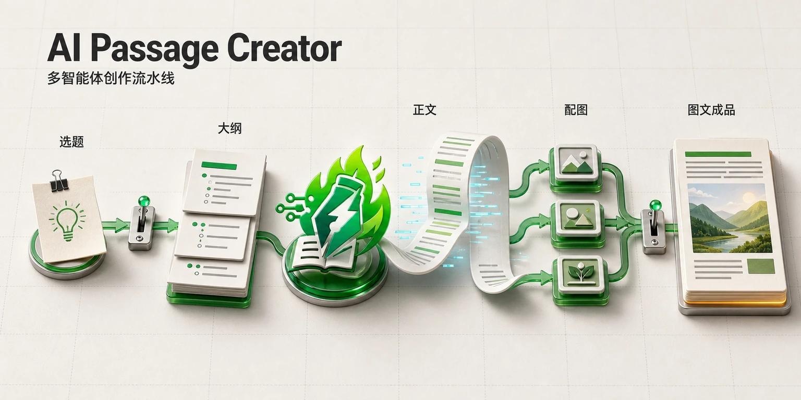
</a>

📐 多 Agent 协作流程

 

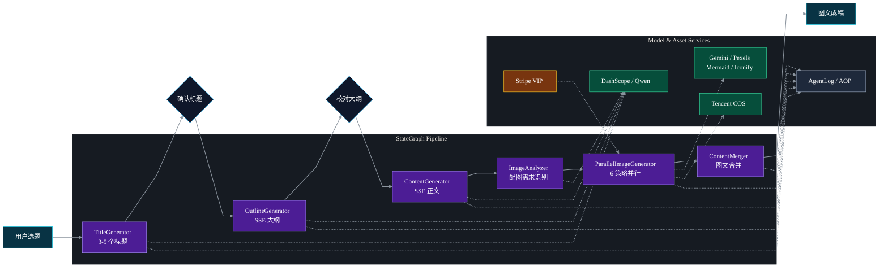
```mermaid
%%{init: {"theme":"base","flowchart":{"curve":"linear","nodeSpacing":38,"rankSpacing":50},"themeVariables":{"background":"#0d1117","primaryTextColor":"#e6edf3","lineColor":"#8b949e","tertiaryColor":"#161b22","clusterBkg":"#161b22","clusterBorder":"#30363d","edgeLabelBackground":"#0d1117","fontFamily":"ui-monospace, SFMono-Regular, Menlo, Monaco, Consolas, monospace"}}}%%
flowchart LR
    U["用户选题"]
    PICK{"确认标题"}
    EDIT{"校对大纲"}
    OUT["图文成稿"]

    subgraph MAIN["StateGraph Pipeline"]
        direction LR
        TITLE["TitleGenerator<br/>3-5 个标题"]
        OUTLINE["OutlineGenerator<br/>SSE 大纲"]
        CONTENT["ContentGenerator<br/>SSE 正文"]
        ANALYZE["ImageAnalyzer<br/>配图需求识别"]
        PARALLEL["ParallelImageGenerator<br/>6 策略并行"]
        MERGE["ContentMerger<br/>图文合并"]
    end

    subgraph CAP["Model & Asset Services"]
        direction TB
        LLM["DashScope / Qwen"]
        IMAGE["Gemini / Pexels<br/>Mermaid / Iconify"]
        COS["Tencent COS"]
        STRIPE["Stripe VIP"]
        LOG["AgentLog / AOP"]
    end

    U --> TITLE --> PICK --> OUTLINE --> EDIT --> CONTENT --> ANALYZE --> PARALLEL --> MERGE --> OUT
    TITLE -.-> LLM
    OUTLINE -.-> LLM
    CONTENT -.-> LLM
    ANALYZE -.-> LLM
    PARALLEL -.-> IMAGE
    PARALLEL -.-> COS
    TITLE -.-> LOG
    OUTLINE -.-> LOG
    CONTENT -.-> LOG
    PARALLEL -.-> LOG
    MERGE -.-> LOG
    STRIPE -.-> PARALLEL

    classDef entry fill:#083344,stroke:#22d3ee,color:#ffffff
    classDef decision fill:#0f172a,stroke:#38bdf8,color:#ffffff
    classDef agent fill:#4c1d95,stroke:#a78bfa,color:#ffffff
    classDef service fill:#064e3b,stroke:#34d399,color:#ffffff
    classDef biz fill:#78350f,stroke:#fbbf24,color:#ffffff
    classDef support fill:#1e293b,stroke:#94a3b8,color:#ffffff
    class U,OUT entry
    class PICK,EDIT decision
    class TITLE,OUTLINE,CONTENT,ANALYZE,PARALLEL,MERGE agent
    class LLM,IMAGE,COS service
    class STRIPE biz
    class LOG support
    linkStyle default stroke:#8b949e,stroke-width:1.5px
```

_补充：专业版架构图，可点击查看 HTML 导出版。_

<a href="./diagrams/ai-passage-creator-architecture.html">
  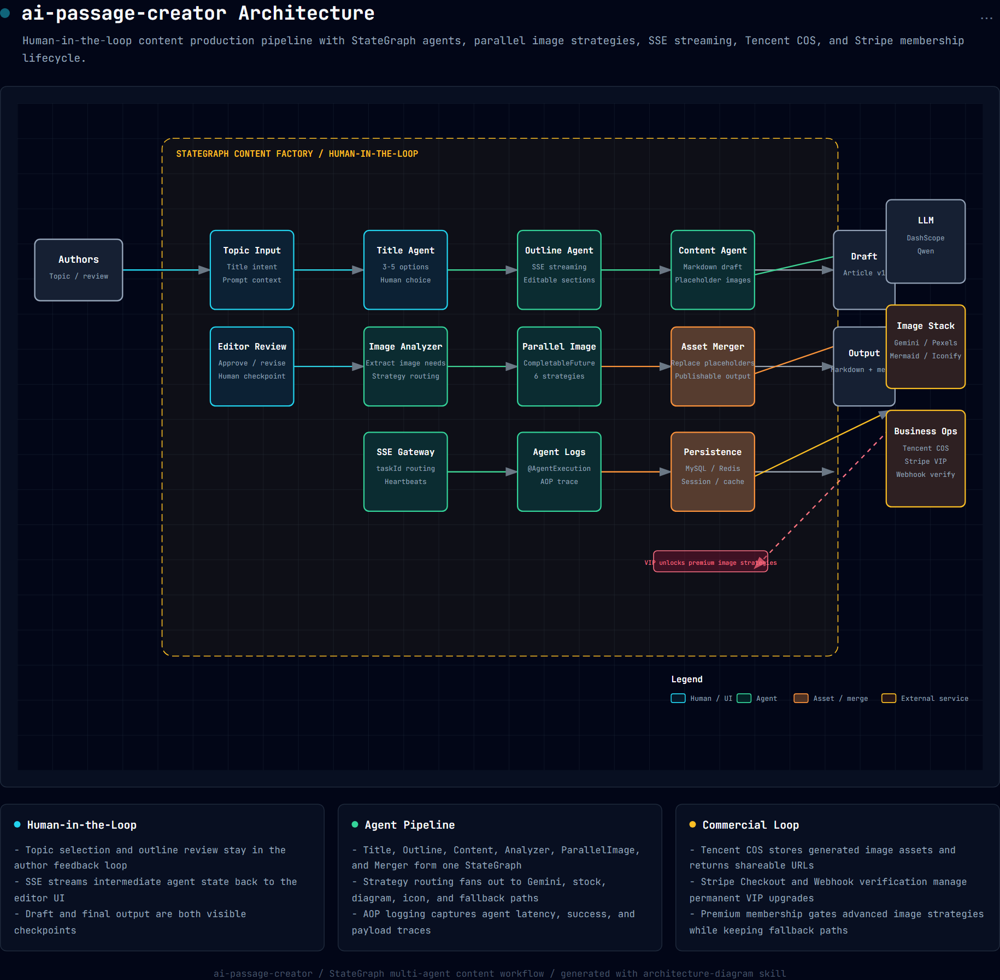
</a>

---

#### 🤖 mewpaw-code — Java 21 CLI Coding Agent

> 纯 Java 实现的命令行编码智能体，ReAct Agent Loop + 5 层安全沙箱 + 6 个内置工具，TUI/REPL 交互体验。

`Java 21` `Spring Boot` `LangChain4j` `picocli` `MCP` `React` `xterm.js`

- 🌀 **ReAct Agent Loop** — Think → Act → Observe 事件流循环（≤50 轮），LLM 流式 + 工具流式输出
- 🛠️ **6 个内置工具** — `bash` / `read_file` / `write_file` / `edit_file` / `glob` / `grep`，可经 MCP 扩展
- 🔒 **5 层安全过滤链** — ToolFilter → PathGuard → CommandScanner → UserConfirm → AuditLog，责任链放行/拦截/确认
- 🖥️ **多模态交互** — picocli CLI + REPL 斜杠命令 + 三档 TUI 渲染（Kitty/Sixel 图形），另附 React 网页工作台

<a href="https://github.com/1byteone/mewpaw-code">
  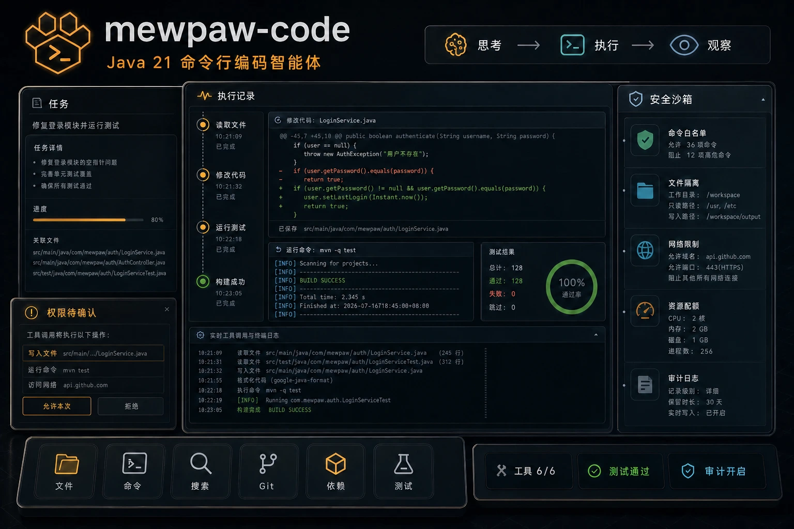
</a>

<strong>中文 Hero 与项目机制图</strong>

 

<a href="https://github.com/1byteone/mewpaw-code">
  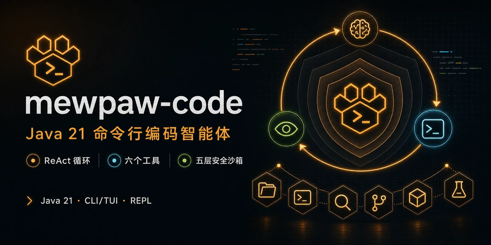
</a>

  

<a href="https://github.com/1byteone/mewpaw-code">
  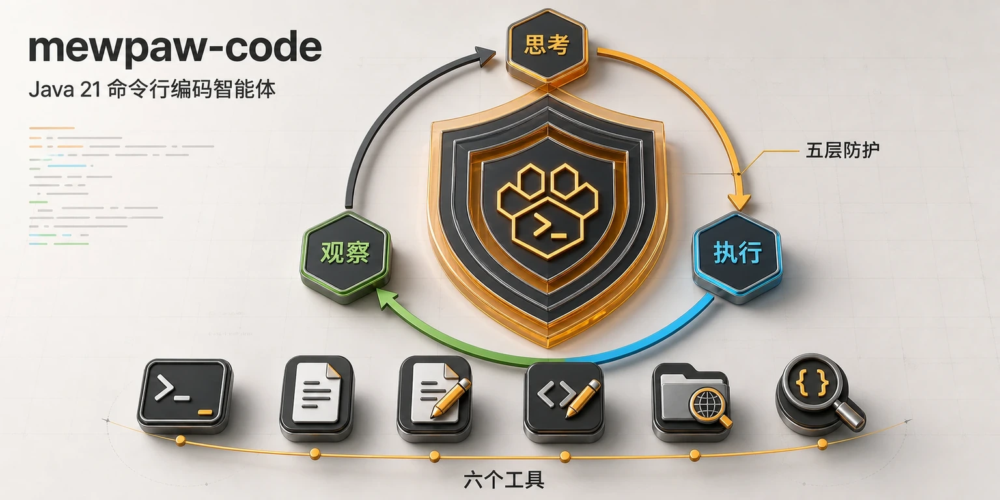
</a>

📐 ReAct Loop &amp; 5 层安全链

 

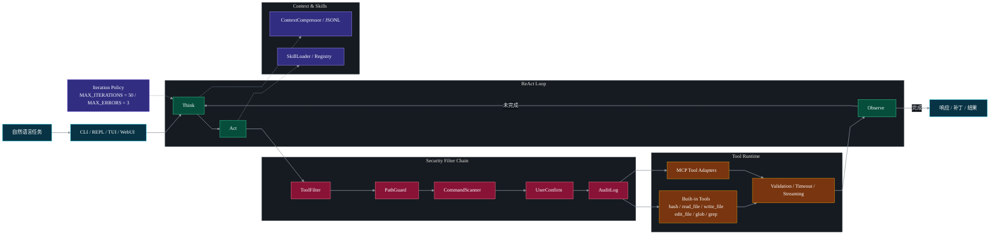
```mermaid
%%{init: {"theme":"base","flowchart":{"curve":"linear","nodeSpacing":38,"rankSpacing":50},"themeVariables":{"background":"#0d1117","primaryTextColor":"#e6edf3","lineColor":"#8b949e","tertiaryColor":"#161b22","clusterBkg":"#161b22","clusterBorder":"#30363d","edgeLabelBackground":"#0d1117","fontFamily":"ui-monospace, SFMono-Regular, Menlo, Monaco, Consolas, monospace"}}}%%
flowchart LR
    U["自然语言任务"]
    I["CLI / REPL / TUI / WebUI"]
    R["响应 / 补丁 / 结果"]
    LIMIT["Iteration Policy<br/>MAX_ITERATIONS = 50 / MAX_ERRORS = 3"]

    subgraph LOOP["ReAct Loop"]
        direction LR
        T["Think"]
        A["Act"]
        O["Observe"]
    end

    subgraph GUARD["Security Filter Chain"]
        direction TB
        TF["ToolFilter"]
        PG["PathGuard"]
        SCAN["CommandScanner"]
        CONFIRM["UserConfirm"]
        AUDIT["AuditLog"]
    end

    subgraph TOOL["Tool Runtime"]
        direction TB
        BUILTIN["Built-in Tools<br/>bash / read_file / write_file<br/>edit_file / glob / grep"]
        MCP["MCP Tool Adapters"]
        HOOK["Validation / Timeout / Streaming"]
    end

    subgraph SUPPORT["Context & Skills"]
        direction TB
        MEM["ContextCompressor / JSONL"]
        SKILL["SkillLoader / Registry"]
    end

    U --> I --> T --> A
    A --> TF --> PG --> SCAN --> CONFIRM --> AUDIT
    AUDIT --> BUILTIN
    AUDIT --> MCP
    BUILTIN --> HOOK --> O
    MCP --> HOOK
    O -->|未完成| T
    O -->|完成| R
    T -.-> MEM
    A -.-> SKILL
    LIMIT -.-> T

    classDef entry fill:#083344,stroke:#22d3ee,color:#ffffff
    classDef loop fill:#064e3b,stroke:#34d399,color:#ffffff
    classDef guard fill:#881337,stroke:#fb7185,color:#ffffff
    classDef tool fill:#78350f,stroke:#f59e0b,color:#ffffff
    classDef support fill:#312e81,stroke:#a78bfa,color:#ffffff
    class U,I,R entry
    class T,A,O loop
    class TF,PG,SCAN,CONFIRM,AUDIT guard
    class BUILTIN,MCP,HOOK tool
    class LIMIT,MEM,SKILL support
    linkStyle default stroke:#8b949e,stroke-width:1.5px
```

_补充：专业版架构图，可点击查看 HTML 导出版。_

<a href="./diagrams/mewpaw-code-architecture.html">
  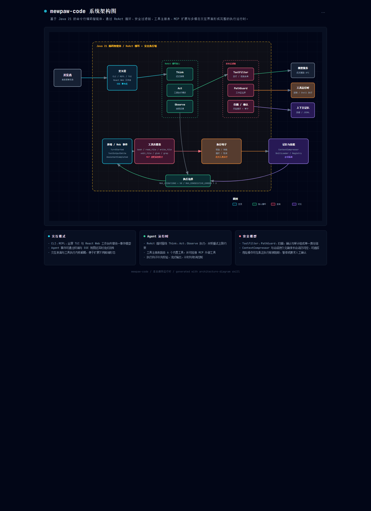
</a>

---

#### 🏥 zznursing — 智颐智慧养老护理平台

> 面向养老机构的综合运营平台，围绕入住、护理、健康评估、设备监测与家属服务形成一体化闭环，集成百度千帆 AI 与华为云 IoTDA。

`Java 11` `Spring Boot 2.5` `Spring Security` `MyBatis-Plus` `Vue 2` `MySQL` `Redis` `百度千帆` `华为云 IoTDA` `微信小程序`

- 🩺 **AI 辅助健康评估** — 体检 PDF 上传到 OSS 后进入解析与结构化流程，再由百度千帆生成健康评估与护理建议
- 📡 **IoT 设备监测闭环** — 华为云 IoTDA + AMQP 接入腕带、床垫等设备，结合 Redis 缓存与报警规则追踪状态
- 🧓 **养老业务一体化** — 老人档案、床位入住、合同、护理计划、护理等级与服务项目统一管理
- 📱 **双端协同服务** — Vue 2 管理端支撑机构运营，微信小程序面向家属提供登录、预约与状态查询
- ⚙️ **企业级平台底座** — Spring Security JWT、Quartz 定时任务、阿里云 OSS 与 MyBatis-Plus 持久层共同支撑业务闭环

<strong>中文 Hero 与项目机制图</strong>

 

<a href="https://github.com/1byteone/zznursing">
  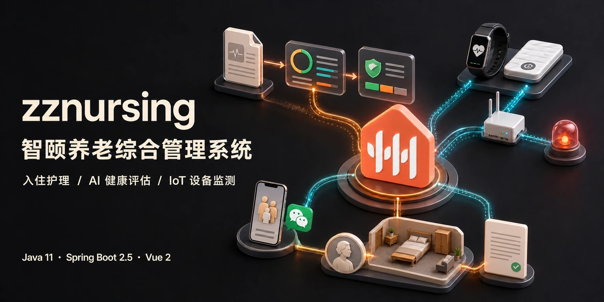
</a>

  

<a href="https://github.com/1byteone/zznursing">
  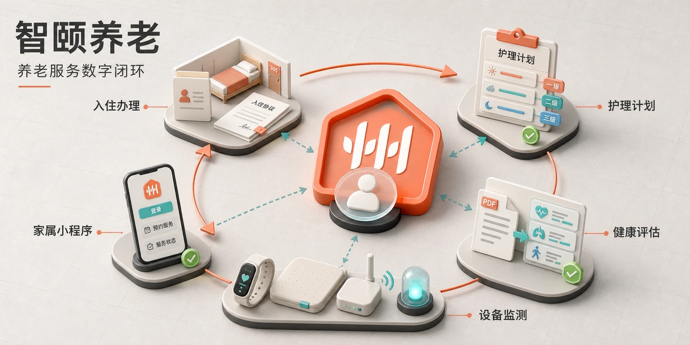
</a>

📐 系统架构

 

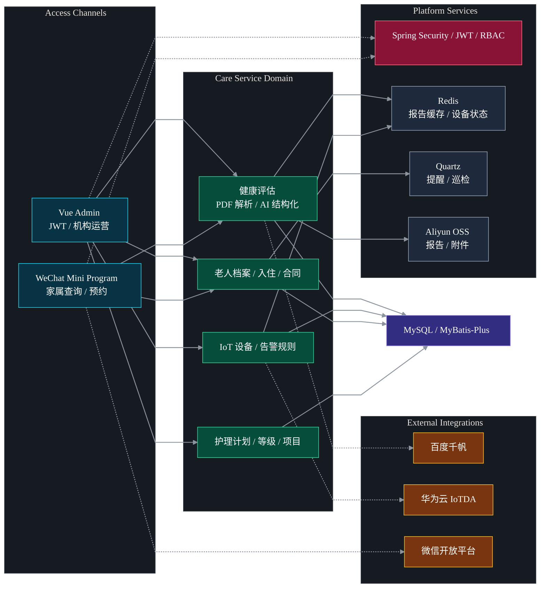
```mermaid
%%{init: {"theme":"base","flowchart":{"curve":"linear","nodeSpacing":38,"rankSpacing":50},"themeVariables":{"background":"#0d1117","primaryTextColor":"#e6edf3","lineColor":"#8b949e","tertiaryColor":"#161b22","clusterBkg":"#161b22","clusterBorder":"#30363d","edgeLabelBackground":"#0d1117","fontFamily":"ui-monospace, SFMono-Regular, Menlo, Monaco, Consolas, monospace"}}}%%
flowchart LR
    subgraph CHANNEL["Access Channels"]
        direction TB
        ADMIN["Vue Admin<br/>JWT / 机构运营"]
        MINI["WeChat Mini Program<br/>家属查询 / 预约"]
    end

    subgraph CORE["Care Service Domain"]
        direction TB
        ELDER["老人档案 / 入住 / 合同"]
        CARE["护理计划 / 等级 / 项目"]
        HEALTH["健康评估<br/>PDF 解析 / AI 结构化"]
        IOT["IoT 设备 / 告警规则"]
    end

    subgraph PLATFORM["Platform Services"]
        direction TB
        SEC["Spring Security / JWT / RBAC"]
        CACHE["Redis<br/>报告缓存 / 设备状态"]
        JOB["Quartz<br/>提醒 / 巡检"]
        OSS["Aliyun OSS<br/>报告 / 附件"]
    end

    subgraph EXT["External Integrations"]
        direction TB
        BAIDU["百度千帆"]
        HUAWEI["华为云 IoTDA"]
        WECHAT["微信开放平台"]
    end

    DB["MySQL / MyBatis-Plus"]

    ADMIN --> ELDER
    ADMIN --> CARE
    ADMIN --> HEALTH
    ADMIN --> IOT
    MINI --> ELDER
    MINI --> HEALTH
    MINI -.-> WECHAT

    ADMIN -.-> SEC
    MINI -.-> SEC
    HEALTH --> OSS
    HEALTH -.-> BAIDU
    HEALTH --> CACHE
    HEALTH --> DB
    IOT -.-> HUAWEI
    IOT --> CACHE
    IOT --> DB
    ELDER --> JOB
    ELDER --> DB
    CARE --> DB

    classDef channel fill:#083344,stroke:#22d3ee,color:#ffffff
    classDef core fill:#064e3b,stroke:#34d399,color:#ffffff
    classDef security fill:#881337,stroke:#fb7185,color:#ffffff
    classDef platform fill:#1e293b,stroke:#94a3b8,color:#ffffff
    classDef ext fill:#78350f,stroke:#fbbf24,color:#ffffff
    classDef data fill:#312e81,stroke:#a78bfa,color:#ffffff
    class ADMIN,MINI channel
    class ELDER,CARE,HEALTH,IOT core
    class SEC security
    class CACHE,JOB,OSS platform
    class BAIDU,HUAWEI,WECHAT ext
    class DB data
    linkStyle default stroke:#8b949e,stroke-width:1.5px
```

_补充：专业版架构图，可点击查看 HTML 导出版。_

<a href="./diagrams/zznursing-architecture.html">
  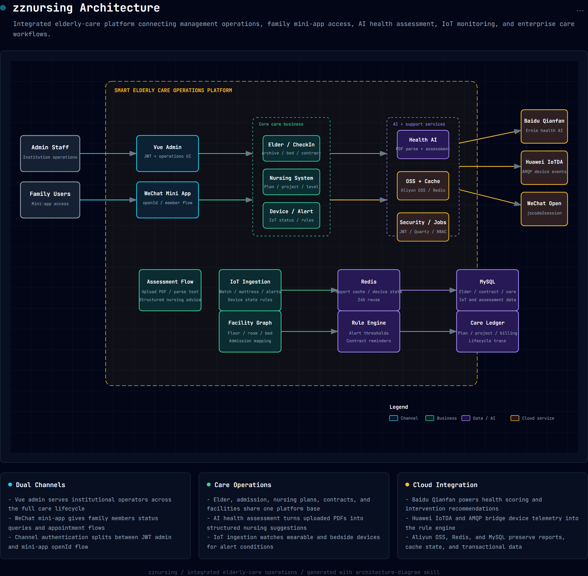
</a>

### Currently Focus

- 🔭 I'm currently working on **Java + AI Agent application development**
- 🌱 I'm currently learning **AI Agent frameworks, LLM application architecture**
- 👯 I'm looking to collaborate on **AI open-source projects**

---

### 📬 Get in Touch

 

*"Building intelligent systems, one line of Java at a time."*

