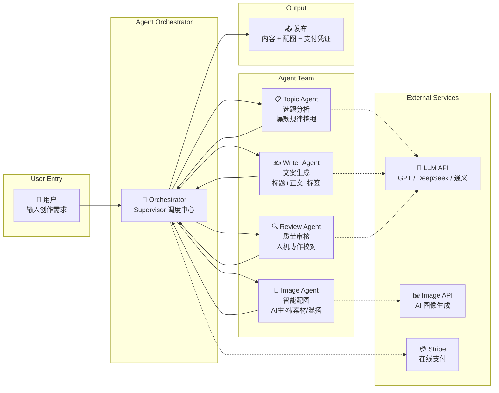

# ai-passage-creator-demo — Multi-Agent Collaboration Flow

```mermaid
graph LR
    subgraph "User Entry"
        U[👤 用户<br/>输入创作需求]
    end

    subgraph "Agent Orchestrator"
        O[🎯 Orchestrator<br/>Supervisor 调度中心]
    end

    subgraph "Agent Team"
        A1[📋 Topic Agent<br/>选题分析<br/>爆款规律挖掘]
        A2[✍️ Writer Agent<br/>文案生成<br/>标题+正文+标签]
        A3[🎨 Image Agent<br/>智能配图<br/>AI生图/素材/混搭]
        A4[🔍 Review Agent<br/>质量审核<br/>人机协作校对]
    end

    subgraph "External Services"
        LLM[🧠 LLM API<br/>GPT / DeepSeek / 通义]
        IMG[🖼️ Image API<br/>AI 图像生成]
        PAY[💳 Stripe<br/>在线支付]
    end

    subgraph "Output"
        PUB[📤 发布<br/>内容 + 配图 + 支付凭证]
    end

    U --> O
    O --> A1
    A1 --> O
    O --> A2
    A2 --> O
    O --> A3
    A3 --> O
    O --> A4
    A4 --> O

    A1 -.-> LLM
    A2 -.-> LLM
    A3 -.-> IMG
    A4 -.-> LLM
    O -.-> PAY

    O --> PUB
```
