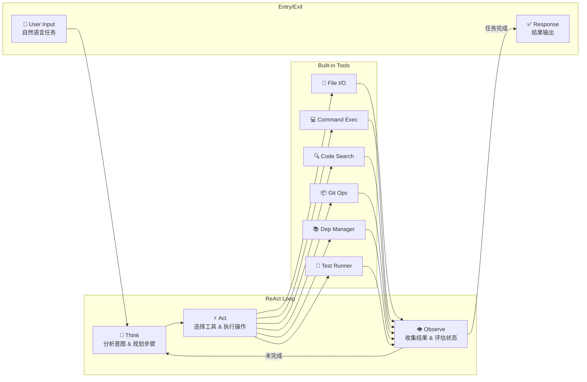
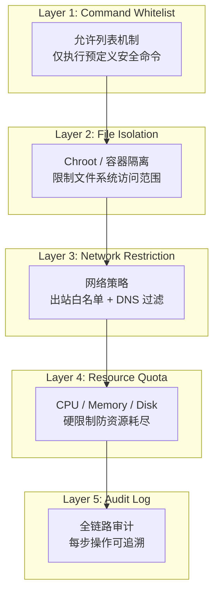

# mewpaw-code — ReAct Agent Loop & Security Architecture

## ReAct Agent Loop

```mermaid
graph LR
    subgraph "ReAct Loop"
        T[💭 Think<br/>分析意图 & 规划步骤]
        A[⚡ Act<br/>选择工具 & 执行操作]
        O[👁️ Observe<br/>收集结果 & 评估状态]
    end

    subgraph "Built-in Tools"
        T1[📁 File I/O]
        T2[💻 Command Exec]
        T3[🔍 Code Search]
        T4[📦 Git Ops]
        T5[📚 Dep Manager]
        T6[🧪 Test Runner]
    end

    subgraph "Entry/Exit"
        U[👤 User Input<br/>自然语言任务]
        R[✅ Response<br/>结果输出]
    end

    U --> T
    T --> A
    A --> T1
    A --> T2
    A --> T3
    A --> T4
    A --> T5
    A --> T6
    T1 --> O
    T2 --> O
    T3 --> O
    T4 --> O
    T5 --> O
    T6 --> O
    O -->|"未完成"| T
    O -->|"任务完成"| R
```

## 5-Layer Security Sandbox

```mermaid
graph TB
    subgraph "Layer 1: Command Whitelist"
        L1[允许列表机制<br/>仅执行预定义安全命令]
    end

    subgraph "Layer 2: File Isolation"
        L2[Chroot / 容器隔离<br/>限制文件系统访问范围]
    end

    subgraph "Layer 3: Network Restriction"
        L3[网络策略<br/>出站白名单 + DNS 过滤]
    end

    subgraph "Layer 4: Resource Quota"
        L4[CPU / Memory / Disk<br/>硬限制防资源耗尽]
    end

    subgraph "Layer 5: Audit Log"
        L5[全链路审计<br/>每步操作可追溯]
    end

    L1 --> L2 --> L3 --> L4 --> L5
```
