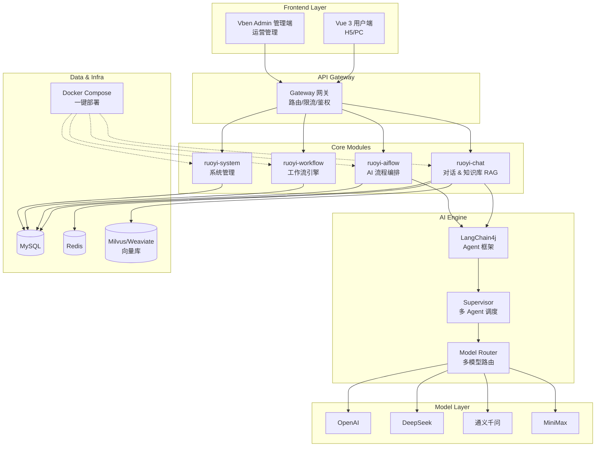

# ruoyi-ai Architecture Diagram

```mermaid
graph TB
    subgraph "Frontend Layer"
        A[Vue 3 用户端<br/>H5/PC]
        B[Vben Admin 管理端<br/>运营管理]
    end

    subgraph "API Gateway"
        C[Gateway 网关<br/>路由/限流/鉴权]
    end

    subgraph "Core Modules"
        D[ruoyi-chat<br/>对话 & 知识库 RAG]
        E[ruoyi-aiflow<br/>AI 流程编排]
        F[ruoyi-workflow<br/>工作流引擎]
        G[ruoyi-system<br/>系统管理]
    end

    subgraph "AI Engine"
        H[LangChain4j<br/>Agent 框架]
        I[Supervisor<br/>多 Agent 调度]
        J[Model Router<br/>多模型路由]
    end

    subgraph "Model Layer"
        K[OpenAI]
        L[DeepSeek]
        M[通义千问]
        N[MiniMax]
    end

    subgraph "Data & Infra"
        O[(MySQL)]
        P[(Redis)]
        Q[(Milvus/Weaviate<br/>向量库)]
        R[Docker Compose<br/>一键部署]
    end

    A --> C
    B --> C
    C --> D
    C --> E
    C --> F
    C --> G

    D --> H
    E --> H
    H --> I
    I --> J
    J --> K
    J --> L
    J --> M
    J --> N

    D --> O
    D --> P
    D --> Q
    E --> O
    F --> O
    G --> O

    R -.-> D
    R -.-> E
    R -.-> F
    R -.-> G
```
