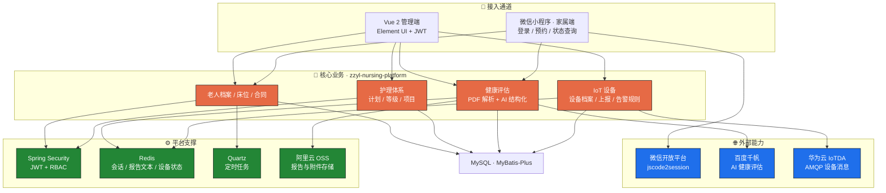

# zznursing - 智颐养老综合管理系统架构

```mermaid
flowchart TB
    subgraph Channels["📱 接入通道"]
        ADMIN["Vue 2 管理端<br/>Element UI + JWT"]
        MINI["微信小程序 · 家属端<br/>登录 / 预约 / 状态查询"]
    end

    subgraph CORE["🏥 核心业务 · zzyl-nursing-platform"]
        ELDER["老人档案 / 床位 / 合同"]
        NURSING["护理体系<br/>计划 / 等级 / 项目"]
        HEALTH["健康评估<br/>PDF 解析 + AI 结构化"]
        DEVICE["IoT 设备<br/>设备档案 / 上报 / 告警规则"]
    end

    subgraph Support["⚙️ 平台支撑"]
        AUTH["Spring Security<br/>JWT + RBAC"]
        CACHE["Redis<br/>会话 / 报告文本 / 设备状态"]
        JOB["Quartz<br/>定时任务"]
        OSS["阿里云 OSS<br/>报告与附件存储"]
    end

    subgraph External["🌐 外部能力"]
        WECHAT["微信开放平台<br/>jscode2session"]
        AI["百度千帆<br/>AI 健康评估"]
        IOT["华为云 IoTDA<br/>AMQP 设备消息"]
    end

    DATA["MySQL · MyBatis-Plus"]

    ADMIN --> ELDER
    ADMIN --> NURSING
    ADMIN --> HEALTH
    ADMIN --> DEVICE
    MINI --> ELDER
    MINI --> HEALTH
    MINI --> WECHAT

    HEALTH --> AI
    HEALTH --> OSS
    DEVICE --> IOT

    ELDER --> AUTH
    NURSING --> AUTH
    HEALTH --> CACHE
    DEVICE --> CACHE
    ELDER --> JOB

    ELDER --> DATA
    NURSING --> DATA
    HEALTH --> DATA
    DEVICE --> DATA

    classDef business fill:#E66A45,stroke:#0d1117,color:#fff
    classDef support fill:#238636,stroke:#0d1117,color:#fff
    classDef external fill:#1F6FEB,stroke:#0d1117,color:#fff
    class ELDER,NURSING,HEALTH,DEVICE business
    class AUTH,CACHE,JOB,OSS support
    class WECHAT,AI,IOT external
```
